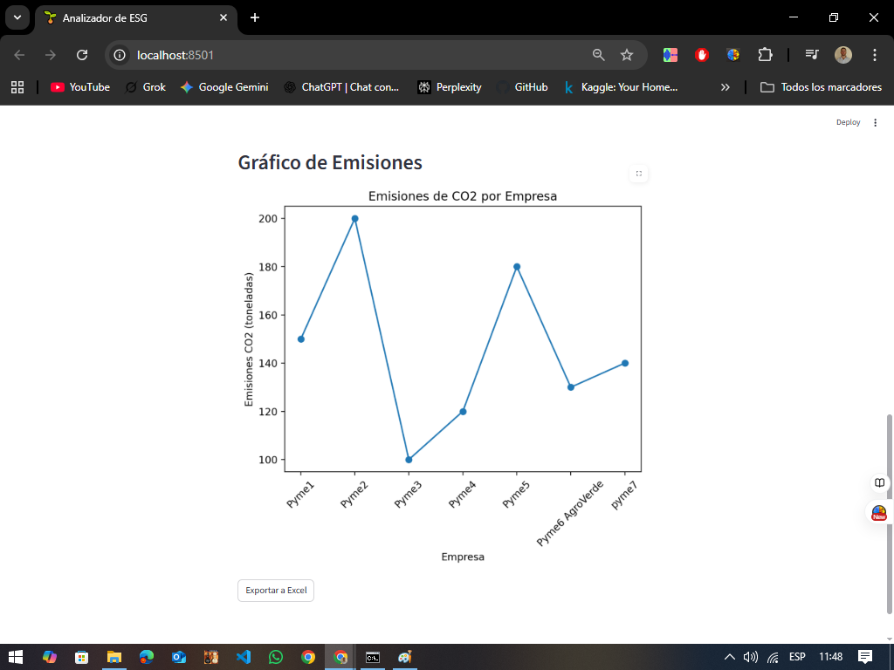
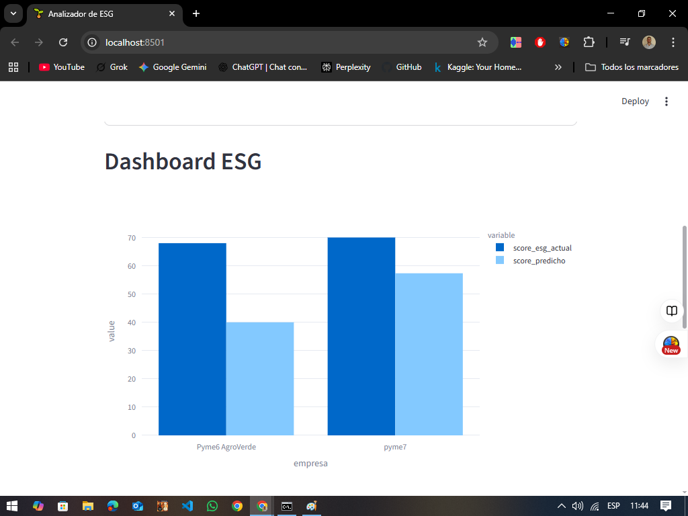
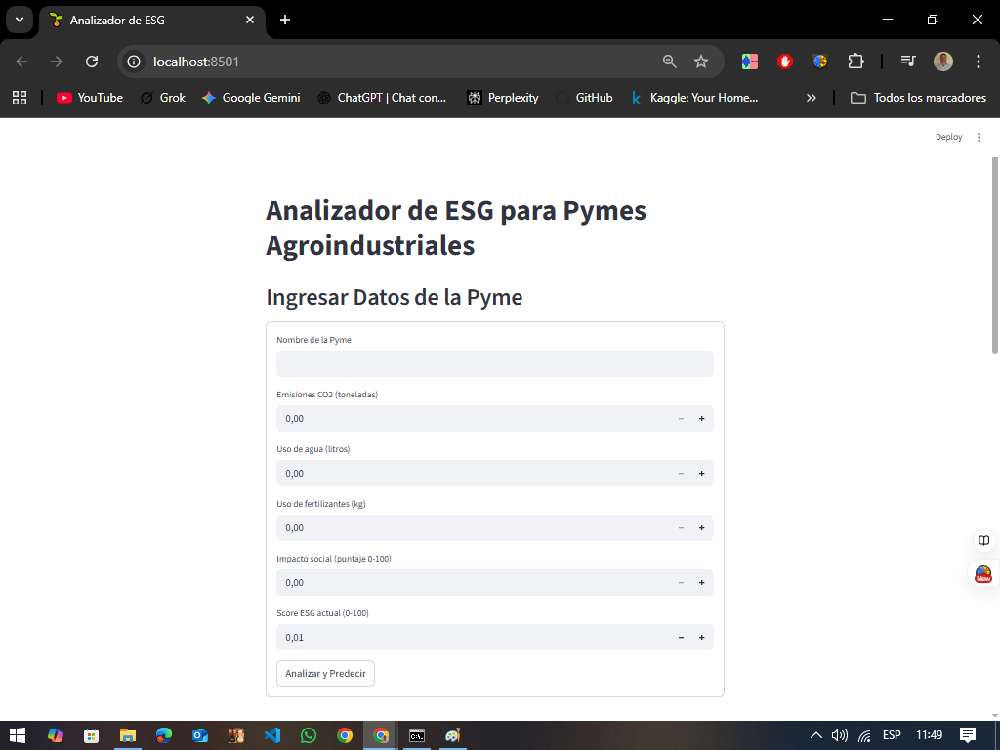

# Analizador de ESG para Pymes Agroindustriales

## Descripción
Herramienta web desarrollada con Streamlit y Python para evaluar el desempeño ESG (Environmental, Social, Governance) de Pymes agroindustriales. Predice scores ESG con Machine Learning y visualiza emisiones de CO2. Enfoque en sostenibilidad con sugerencias como biofertilizantes.

## Tecnologías
- **Python**: Streamlit, Scikit-learn, SQLite, Matplotlib, Plotly
- **Datos**: SQLite, Excel
- **Visualización**: Gráficos interactivos

## Instrucciones
1. Clona el repositorio:
   ```bash
   git clone https://github.com/eldinu1986m/Analizador-ESG-Pymes
   cd Analizador-ESG-Pymes

2. Instala dependencias:
    bashpip install streamlit pandas scikit-learn plotly matplotlib openpyxl
3. Ejecuta la app:
    bashstreamlit run app.py

4. Accede a http://localhost:8501.

Archivos

app.py: Código principal.
datos_esg.csv: Datos iniciales.
db.sqlite: Base de datos.
reporte_esg.xlsx: Exportación de datos.


## Capturas de Pantalla

### Gráfico de Emisiones de CO2


### Dashboard ESG - Comparación de Scores


### Formulario de Ingreso de Datos


Contribución
Proyecto inspirado en la sostenibilidad y biofertilizantes. ¡Bienvenido a contribuir!


